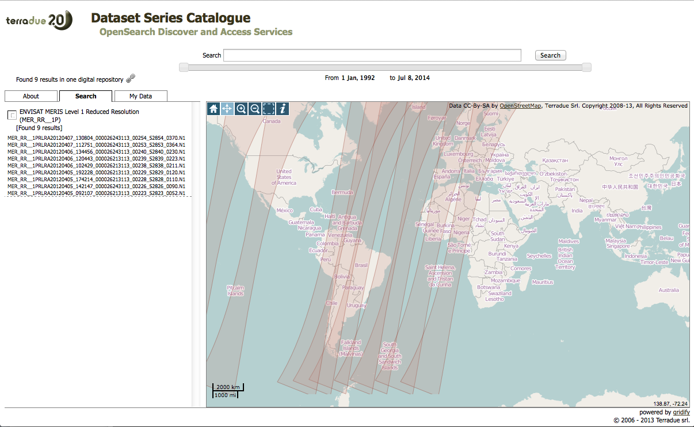
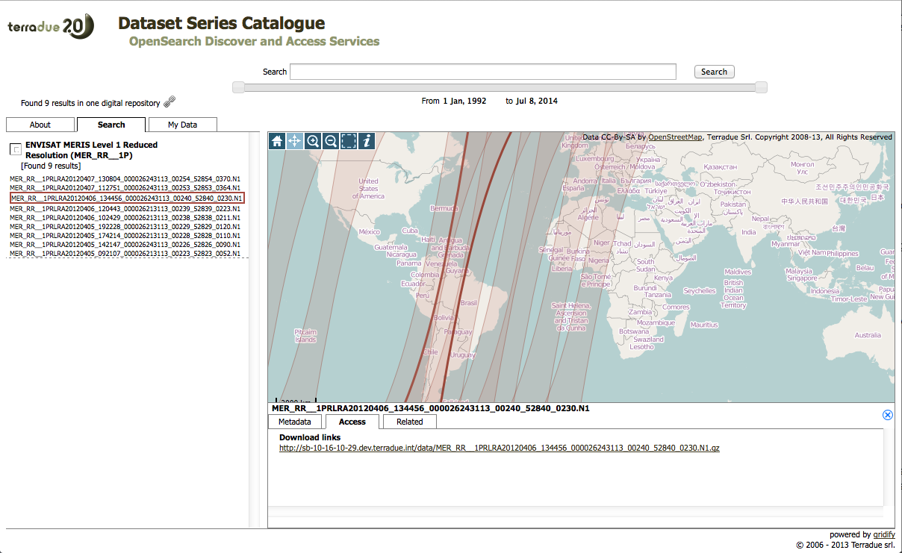
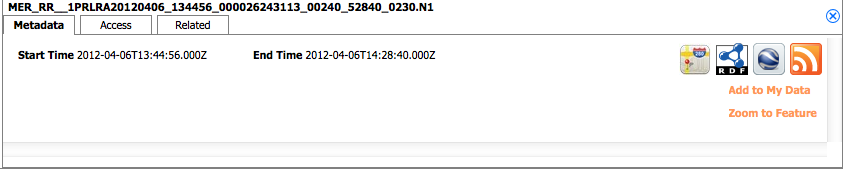

Data preparation
================

The data preparation step foresees to copy test data to the sandbox, and register it in the sandbox's local catalogue service. 

The application uses Envisat MERIS Level 1 Reduced Resolution data. ESA provides access to the full mission data through MyEarthNet, and via the G-POD service.

With the purpose of serving user applications, Terradue has created a Cloud Platform catalogue that can be used as a source catalogue. This Catalogue is hosting a subset of the Envisat MERIS Level 1 Reduced Resolution mission data. 

The following section shows how to copy the test data on the sandbox's local storage and register it on the sandbox's local catalogue. 
The same techniques can be applied with the ESA G-POD catalogue or with other OpenSearch catalogues.
 
Copying test data on your Sandbox
*********************************

The sandbox includes a catalogue service exposing the OpenSearch interface. 
A Web Client is available at http://localhost/catalogue/sandbox for interactive search and retrieve tasks.
At initialisation, the sandbox contains no data, so clicking on the Search button will not return any results.

You will use the ciop-catcp [#f1]_ utility to copy both the data and metadata from a source catalogue. The source catalogue that we consider here is Terradue's Cloud Platform catalogue, containing a subset of the Envisat MERIS mission. 
The ciop-catcp utility takes an OpenSearch URL and a few options to optionally copy the data and register the metadata.  

On the sandbox' shell, run the command:

.. code-block:: console

 ciop-catcp -m byval "http://catalogue.terradue.int/catalogue/search/MER_RR__1P/rdf?start=2012-04-05T10:00:00&stop=2012-04-08"

This will take the Envisat MERIS Level 1 acquisitions available on Terradue's catalogue and copy them to the local sandbox filesystem and catalogue. The operation can take a few minutes. Then you will get a message about things being successfully registered in the local catalogue.

To check the registered data and verify its accessibility, go back to the sandbox catalogue Web Client, and click the 'Search' button. The graphical interface will show the data now available locally to the sandbox.

  The Sandbox catalogue user interface showing the registered data

Click on one product from the list on the left, and then on the Access tab below the map. 

  The Sandbox catalogue user interface showing the selected product details
  
Finally click on the related HTTP URL. The download of the selected MERIS Level 1 product starts.

Copy the link to the selected MERIS file, go back to the sandbox shell and type

.. code-block:: console

 cd 
 ciop-copy -o ./ http://localhost/data/MER_RR__1PRLRA20120407_112751_000026243113_00253_52853_0364.N1

This will copy the locally registered MER_RR__1PRLRA20120407_112751_000026243113_00253_52853_0364.N1 product in the Sandbox' home folder.

The ciop-copy [#f2]_ utility does more than simply copying HTTP URLs, it can also consume the catalogue entry RDF URL as input. 
Go back to the catalogue Web Client, and click on the Metadata tab, and then on the RDF logo:

  The Sandbox catalogue interface tab for product metadata

This will open the MERIS product catalogue entry in the RDF format. Copy that URL in order to use it as argument to ciop-copy:

.. code-block:: console

 cd
 ciop-copy -o ./ http://localhost/catalogue/sandbox/MER_RR__1P/MER_RR__1PRLRA20120407_112751_000026243113_00253_52853_0364.N1/rdf
 
Once the download is completed, the MERIS product is available in your /home folder. The same strategy is adopted when copying a file from the storage in a run executable.

.. admonition:: Congrats!

 There is now some test data on your Sandbox! 

.. rubric:: Footnotes

.. [#f1] :doc:`ciop-catcp man page </reference/man/bash_commands_functions/catalogue/ciop-catcp>`
.. [#f2] :doc:`ciop-copy man page </reference/man/bash_commands_functions/data/ciop-copy>`
